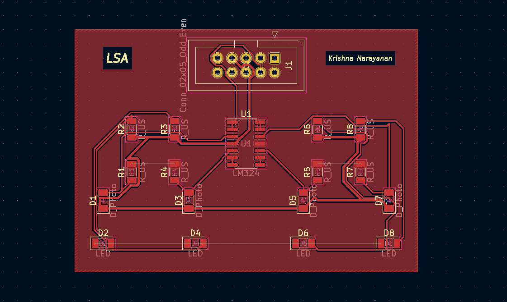
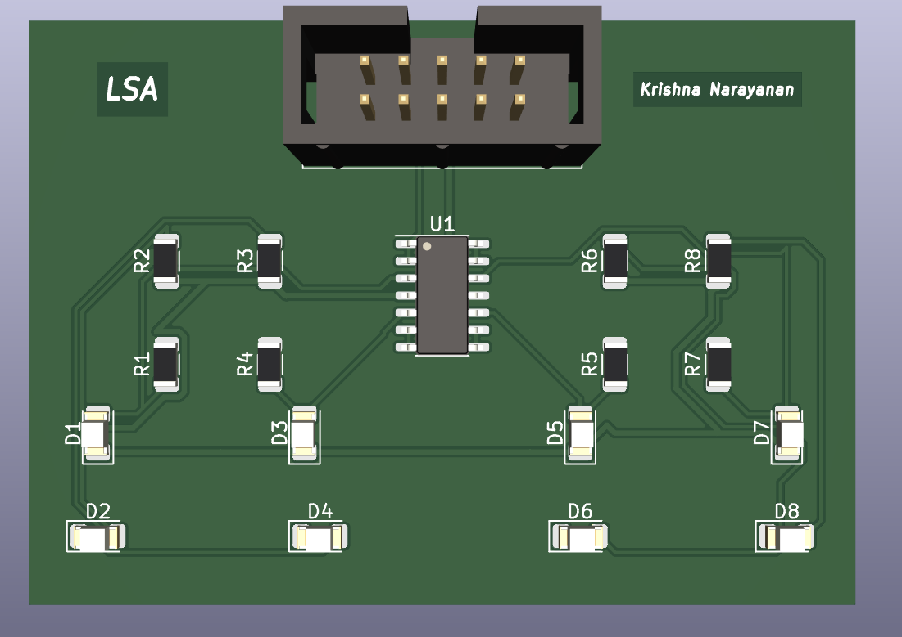
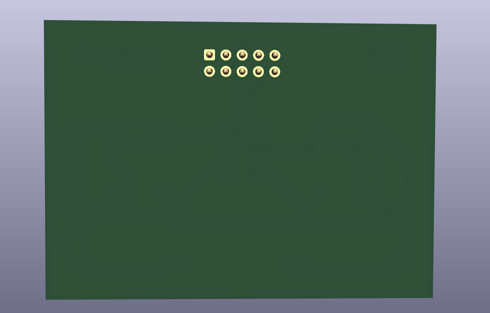

# PCB Designing - Line Sensor Array (LSA)
## Using kiCAD - Open Source Software
This repository contains hardware design files and datasheets for the Line Sensor Array. This project is in development and is not ready for release.

## Features
- 1 layered PCB design
- easy, cheap to manufacture
- separate provision for power and signal lines

## Uses
- Line Following
- Path Tracking

## Tools
To view/modify the files from this repository, install KiCAD from: [https://kicad.org](https://kicad.org)

## Layout

## Plots
### Front side
)

### Back side

### Mentor
* Special thanks to [Dhairya Shah](https://github.com/dhairyashah1)
